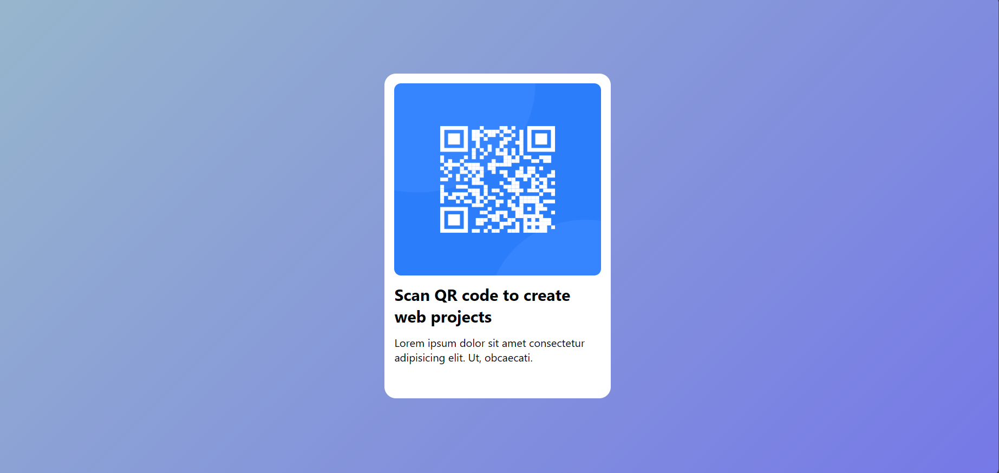

# HTML_cards

"A visually appealing and responsive card component created using HTML and CSS.
This card is designed for showcasing content like titles, images, and descriptions, 
making it perfect for use in portfolios, blogs, or project showcases."

